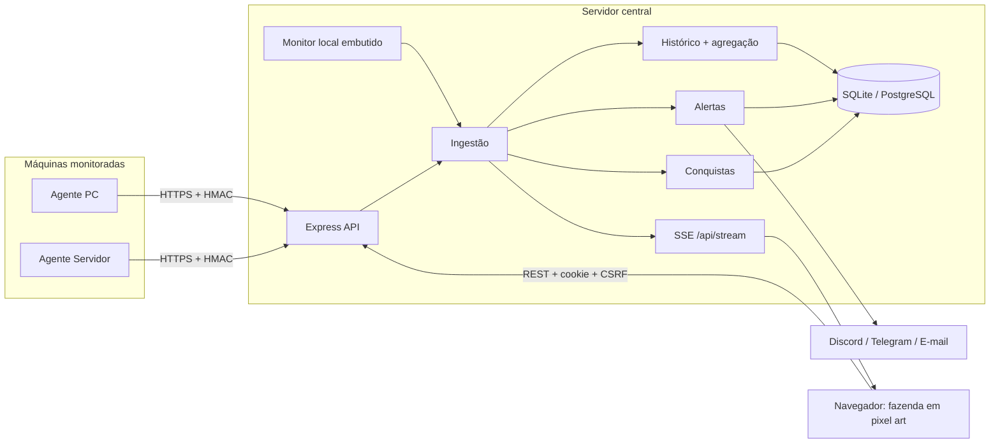
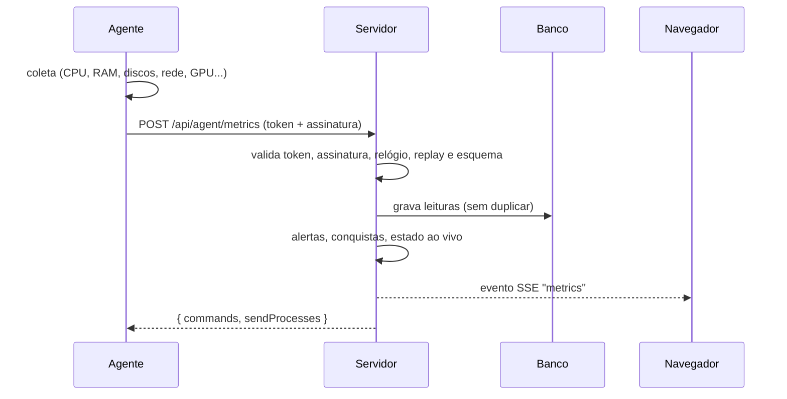
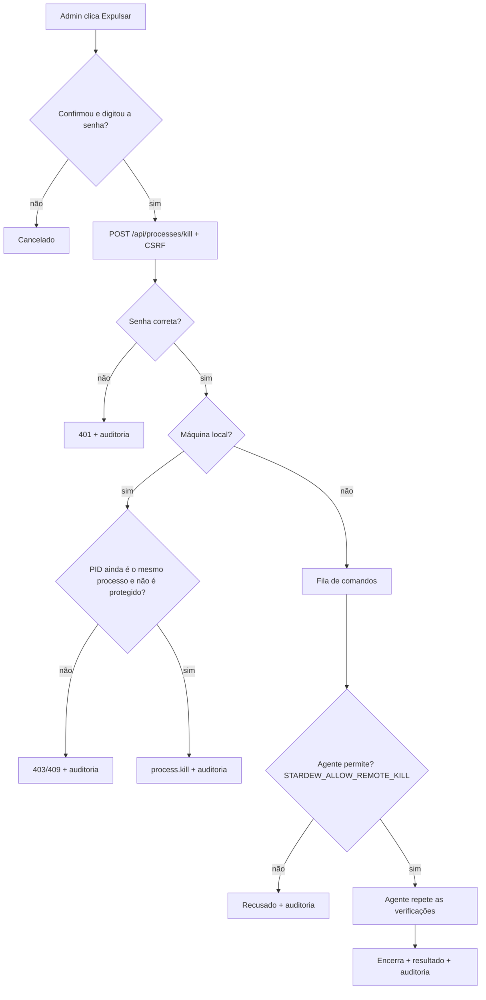
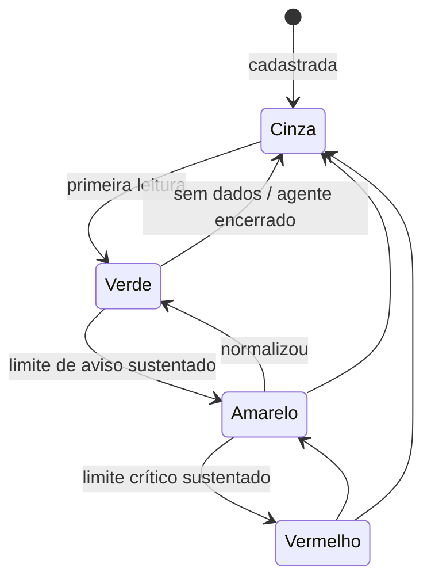

# Diagramas

## Componentes

```mermaid
flowchart LR
  subgraph Máquinas monitoradas
    A1[Agente PC] 
    A2[Agente Servidor]
  end
  subgraph Servidor central
    L[Monitor local embutido]
    API[Express API]
    I[Ingestão]
    AL[Alertas]
    CQ[Conquistas]
    H[Histórico + agregação]
    SSE[SSE /api/stream]
    DB[(SQLite / PostgreSQL)]
  end
  N[Discord / Telegram / E-mail]
  B[Navegador: fazenda em pixel art]

  A1 -- HTTPS + HMAC --> API
  A2 -- HTTPS + HMAC --> API
  L --> I
  API --> I
  I --> H --> DB
  I --> AL --> N
  AL --> DB
  I --> CQ --> DB
  I --> SSE --> B
  B -- REST + cookie + CSRF --> API
```

## Leitura de um agente

```mermaid
sequenceDiagram
  participant Ag as Agente
  participant S as Servidor
  participant DB as Banco
  participant Nav as Navegador
  Ag->>Ag: coleta (CPU, RAM, discos, rede, GPU...)
  Ag->>S: POST /api/agent/metrics (token + assinatura)
  S->>S: valida token, assinatura, relógio, replay e esquema
  S->>DB: grava leituras (sem duplicar)
  S->>S: alertas, conquistas, estado ao vivo
  S-->>Nav: evento SSE "metrics"
  S-->>Ag: { commands, sendProcesses }
```

## Expulsar morador (encerrar processo)

```mermaid
flowchart TD
  U[Admin clica Expulsar] --> C{Confirmou e digitou a senha?}
  C -- não --> X[Cancelado]
  C -- sim --> P[POST /api/processes/kill + CSRF]
  P --> R{Senha correta?}
  R -- não --> A1[401 + auditoria]
  R -- sim --> L{Máquina local?}
  L -- sim --> V{PID ainda é o mesmo processo e não é protegido?}
  V -- não --> A2[403/409 + auditoria]
  V -- sim --> K[process.kill + auditoria]
  L -- não --> Q[Fila de comandos]
  Q --> AG{Agente permite? STARDEW_ALLOW_REMOTE_KILL}
  AG -- não --> F[Recusado + auditoria]
  AG -- sim --> V2[Agente repete as verificações] --> K2[Encerra + resultado + auditoria]
```

## Estado de uma fazenda em Pelican Town

```mermaid
stateDiagram-v2
  [*] --> Cinza: cadastrada
  Cinza --> Verde: primeira leitura
  Verde --> Amarelo: limite de aviso sustentado
  Amarelo --> Vermelho: limite crítico sustentado
  Vermelho --> Amarelo
  Amarelo --> Verde: normalizou
  Verde --> Cinza: sem dados / agente encerrado
  Amarelo --> Cinza
  Vermelho --> Cinza
```
